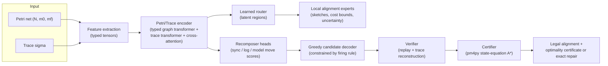

# Approach: The LARA Foundation Model

LARA (Learned Alignment with Replay Assurance) is a neural-guided, *certifying*
system for Petri-net trace alignment. The design separates **candidate
generation** (learned, fast, uncertified) from **certification** (exact,
pm4py-based, trusted). This document details (1) the architecture of the
neural foundation model, (2) how the exact-labeled training data is created,
and (3) the training procedure, its hyperparameters, and the metrics tracked
during training. Notation follows `preliminaries.md`.

## 1. System Overview

The invariant maintained throughout: **neural output is never trusted as a
certificate.** The model proposes; exact Petri-net replay decides legality; the
pm4py exact backend decides optimality. In *fast* mode the system returns the
verified learned candidate (an upper bound on the optimal cost); in *certified*
mode it additionally runs the exact aligner and either certifies the candidate
by cost equality or returns the exact alignment as a repair.

## 2. Input Encoding

`pm4py_to_features` converts a pm4py net/trace pair into typed tensors
(`lara_align/features.py`). The net is represented as a bipartite graph with
places first and transitions second.

**Place features** (5 per place): initial-marking tokens, final-marking tokens,
in-degree, out-degree, total degree.

**Transition features** (6 per transition): invisibility flag
($\lambda(t)=\tau$), in-degree, out-degree, model-move cost $c(\gg,t)$,
synchronous-move cost, and a self-loop-context flag
($\bullet t \cap t\bullet \neq \emptyset$).

**Typed edges (bidirectional)**: every arc is materialized in both directions
with four relation types — `0`: place→transition along consumption arcs, `1`:
transition→place along production arcs, `2`: the reversal of consumption (a
place hears from its consumers), `3`: the reversal of production (a transition
hears from its output places). The reverse types are essential for
duplicate-label resolution: the context that distinguishes two transitions
sharing a label (e.g., which branch suffix follows each of them) lies
*downstream*, and messages restricted to arc direction can never deliver it —
duplicate transitions with symmetric presets would receive provably identical
embeddings, and global attention cannot separate them because identical
embeddings issue identical queries. Bidirectional typed messages carry the
disambiguating context in two hops (suffix transition → shared place →
duplicate transition), which is what allows the sync head to discriminate
transition identities (`assessment.md` §4).

**Labels via hashing.** Activity labels are mapped into a bounded vocabulary of
8,192 ids by a stable BLAKE2b hash (`stable_label_id`), with id 0 reserved for
$\tau$. Hashing makes the model *label-vocabulary-free*: it can embed activity
names it has never seen during training, a prerequisite for foundation-model
use across event logs. Crucially, an event and a transition with the same label
receive the same embedding id, which is the inductive bias that lets the model
tie trace positions to candidate transitions.

**Compatibility mask.** A boolean matrix
$C \in \{0,1\}^{n \times |T|}$ with $C_{ij} = 1$ iff event $i$ and transition
$j$ carry the same visible label. It hard-masks synchronous-move scores so the
model can only propose label-consistent synchronous moves.

## 3. Neural Architecture

`LARANeuralModel` (`lara_align/model.py`) has four components.

### 3.1 Petri/Trace Encoder

- **Node embedding.** Place and transition feature rows are linearly projected
  to the hidden dimension $d = 96$; transitions additionally receive their
  hashed label embedding; a 2-way node-type embedding distinguishes places from
  transitions.
- **Typed graph transformer (2 layers).** Each `TypedGraphTransformerLayer`
  combines (i) full self-attention over all net nodes (4 heads) with (ii)
  relation-specific message passing: per edge type (4 types, forward and
  reverse), source embeddings pass through a dedicated linear map and are
  mean-aggregated into targets. The sum of attention output and typed messages
  enters a pre-norm residual block with a 4× GELU feed-forward.
- **Trace transformer (1 layer).** Events are embedded via the shared label
  embedding plus learned positional embeddings (max length 4,096) and encoded
  by a standard Transformer encoder (4 heads, 4× GELU feed-forward).
- **Cross-attention coupling.** One bidirectional multi-head cross-attention
  round lets events attend to transitions and transitions attend to events,
  each followed by a residual LayerNorm. This is where trace context flows into
  transition representations (and vice versa), making all downstream heads
  *trace-dependent*.

### 3.2 Learned Router (latent regions)

Two linear heads map transition and event embeddings to soft assignments over
$R = 6$ latent regions (softmax). The router is the learned analogue of
decomposition-based alignment: instead of a fixed structural decomposition of
the net, region membership is predicted per (net, trace) pair. Three
regularizers (Section 5) push the assignments toward decompositions that are
balanced, confident, and structurally coherent.

### 3.3 Local Alignment Experts

For each region, transition and event embeddings are pooled by
assignment-probability-weighted averaging, concatenated, and passed through a
2-layer GELU MLP. Per region the experts predict:

- **sketch logits** over $S = 4$ local alignment sketches per region
  (a coarse classification of the local deviation pattern);
- a **lower cost bound** (Softplus, non-negative);
- an **upper cost bound**, parameterized as lower bound + non-negative
  Softplus increment so that $\widehat{ub} \geq \widehat{lb}$ by construction;
- an **uncertainty** estimate (Softplus).

The summed upper bounds $\sum_r \widehat{ub}_r$ serve as the model's global
cost estimate and are supervised against the optimal cost. Predicted bounds
are *diagnostic* signals for search prioritization; they are never used as
admissible heuristics, because a learned bound carries no admissibility
guarantee.

### 3.4 Recomposer Heads

Global move scores over the full (net, trace) pair:

- **Synchronous-move logits** $\mathrm{sync} \in \mathbb{R}^{n \times |T|}$,
  computed as a scaled bilinear form
  $(W e_i)^\top h_j / \sqrt{d}$ between event embedding $e_i$ and transition
  embedding $h_j$, hard-masked by the compatibility matrix ($-10^9$ where
  labels differ). Row $i$ is the model's belief about *which concrete
  transition* event $i$ should synchronize with — this is where duplicate-label
  resolution happens.
- **Log-move logits** $\in \mathbb{R}^{n}$: per event, the belief that it is
  a deviation to be skipped.
- **Model-move logits** $\in \mathbb{R}^{|T|}$: per transition, the belief
  that it must fire without log support.

### 3.5 Parameter Budget

Default configuration of the evaluated checkpoint (hidden 96, 4 heads, 2 graph
layers, 1 trace layer, 6 regions, 4 sketches/region, 4 edge types):

| component | parameters |
|---|---:|
| Petri/Trace encoder | 1,665,216 |
| Learned router | 1,164 |
| Local alignment experts | 28,519 |
| Recomposer heads | 9,410 |
| **total** | **1,704,309** |

The encoder dominates; within it, the hashed label embedding
(8,192 × 96 ≈ 0.79M) and positional embedding (4,096 × 96 ≈ 0.39M) account
for more than half of all parameters. At ~1.7M parameters the model runs
comfortably on CPU.

## 4. Candidate Decoding, Verification, and Certification

**Greedy constrained decoder** (`GreedyCandidateDecoder`). The decoder walks
the trace left to right while tracking the current marking, so every emitted
move is fireable by construction:

1. For event $a_i$, collect *enabled* transitions with label $a_i$ and pick
   the one with the highest sync logit (duplicate-label resolution).
2. If none is enabled, run a bounded breadth-first search over markings (depth
   ≤ 8) for a model-move path that enables label $a_i$; successor transitions
   are ordered invisible-first, then by model-move logit. If found, emit the
   path as model moves and synchronize.
3. Otherwise emit a log move for $a_i$.
4. After the last event, search a model-move path to $m_f$ (depth ≤ 32).

For speed, the decoder precomputes a per-net runtime before the walk: indexed
presets/postsets, place-to-consumer lists (so only transitions consuming from
marked places are tested for enabledness), zero-free dict markings, and neural
scores extracted once into Python floats. This keeps the search cost mild in
net size; the neural forward pass dominates fast-mode wall time
(`assessment.md` §7.1).

**Verifier** (`verify_alignment`). Replays the transition projection from
$m_0$, checks that $m_f$ is reached and that the log projection reconstructs
$\sigma$ exactly, and computes the candidate's cost under the unit cost model.

**Certifier** (`CertifyingAlignmentSystem`). Three modes: `FAST` returns the
verified candidate (its cost is an upper bound on $\delta$); `CERTIFIED` also
runs pm4py's state-equation A* — if the legal candidate's cost equals the exact
cost, the candidate is certified optimal, otherwise the exact alignment is
returned as the repair; `ANYTIME` degrades gracefully when the exact backend
fails or times out, returning the best available bounds.

## 5. Training Objective

`LARALoss` (`lara_align/training.py`) is a composite of imitation, cost
shaping, and router regularization. Targets are derived from the pm4py optimal
alignment of each sample (`targets_from_alignment`): for each trace position, a
synchronous-target transition index (or −1), a binary log-move flag; for each
transition, a binary model-move flag.

$$\mathcal{L} = w_m\,(\mathcal{L}_{\text{sync}} + \mathcal{L}_{\text{log}} + \mathcal{L}_{\text{model}}) + w_c\,\mathcal{L}_{\text{cost}} + w_b\,\mathcal{L}_{\text{boundary}} + w_\ell\,\mathcal{L}_{\text{balance}} + w_e\,\mathcal{L}_{\text{entropy}}$$

| term | definition | weight |
|---|---|---:|
| $\mathcal{L}_{\text{sync}}$ | cross-entropy of sync logits vs. the optimal transition identity, over positions aligned synchronously | 1.0 |
| $\mathcal{L}_{\text{log}}$ | binary cross-entropy of log-move logits vs. optimal log moves (optional label smoothing) | 1.0 |
| $\mathcal{L}_{\text{model}}$ | binary cross-entropy of model-move logits vs. transitions fired as model moves | 1.0 |
| $\mathcal{L}_{\text{cost}}$ | smooth-L1 ($\beta = 1$) between $\sum_r \widehat{ub}_r$ and the optimal cost $\delta$ | 0.03 |
| $\mathcal{L}_{\text{boundary}}$ | for transitions sharing a place, expected probability of falling in different regions (structural coherence of the learned decomposition) | 0.01 |
| $\mathcal{L}_{\text{balance}}$ | variance of mean region loads across transitions and events (avoid region collapse) | 0.01 |
| $\mathcal{L}_{\text{entropy}}$ | mean assignment entropy (push toward confident routing) | 0.001 |

Supervising the *transition identity* (not merely the label) in
$\mathcal{L}_{\text{sync}}$ is what teaches duplicate-label disambiguation.

## 6. Training Data Creation

`scripts/init_data.py` generates a fully *exact-labeled* synthetic corpus. Its
unit is a **behavior family**, not one independently sampled net/trace pair.
Each family fixes a visible behavior, realizes it as two Petri nets, chooses
two clean complete traces, and applies each trace corruption once at label
level. Pairing the same two observed traces with both nets gives four rows per
family and makes representation comparisons genuinely paired.

### 6.1 What the four motifs and their representations mean

The three controlled motifs below receive the same two fresh sequential
activities as a suffix after the displayed core behavior. The suffix makes
their traces less degenerate without changing the comparison.

| motif | core complete visible traces | representation 1 | representation 2 |
|---|---|---|---|
| ordinary tree | language of a newly sampled process tree | canonical block compilation | isomorphic rename of that compiled net |
| duplicate / silent | `A B` or `A C` | two concrete `A` transitions, leading to `B` and `C` | one `A`, followed by an invisible choice to `B` or `C` |
| concurrency / interleaving | `A B` or `B A` | an invisible AND split/join around concurrent `A` and `B` | an explicit XOR between the two sequential paths `A B` and `B A` |
| M-pattern | `B`, `A C`, or `C A` | block-structured XOR between `B` and `AND(A,C)` | non-free-choice net where `A` and `C` consume separate places but `B` consumes both |

**Ordinary tree** is the generator's name for its heterogeneous random
process-tree class; it does not mean a Petri net whose graph is a tree. A tree
has 4–12 visible leaf occurrences and depth at most 6. Internal operators are
sequence, XOR, and AND with probabilities 0.4/0.3/0.3. Labels are sampled from
an alphabet about 70% as large as the leaf count, so repeated labels arise
naturally.

**Canonical block** means the output of this codebase's deterministic compiler,
not a mathematically unique Petri-net normal form. A leaf becomes one visible
transition; a sequence chains child blocks through places; XOR children share
entry and exit places; and an AND block receives an invisible split and join.
For an ordinary tree this compiler handles the sampled tree. For the M family,
it compiles the fixed tree `XOR(B, AND(A,C))`.

**Isomorphic rename** clones the canonical ordinary-tree net and permutes only
place and transition *names*. It preserves the bipartite graph, arc weights,
visible transition labels, and initial/final markings under the one-to-one
mapping. Hence language and optimal costs are identical. The renaming is still
experimentally useful because the unguided decoder breaks equal structural
choices by transition-name order; its output need not be invariant to this
otherwise semantics-preserving change.

**Explicit interleaving** removes true token concurrency. Instead of enabling
`A` and `B` together after an AND split, it creates two exclusive sequential
paths, `A` then `B` and `B` then `A`. It preserves the complete visible
language but not causal structure. The **non-free-choice M-net** similarly
preserves the M-family language without preserving block structure: after an
invisible split creates two tokens, `A` consumes the left token, `C` the right,
and `B` requires both. Thus `B` is in conflict with each side although their
presets are unequal—the characteristic non-free-choice M relation.

### 6.2 Generation and validation pipeline

1. **Allocate complete families.** Deterministic quotas balance the four motifs
   and assign whole behavior IDs to train/validation/test before expansion, so
   equivalent representations never cross splits.
2. **Certify representation equivalence.** The generator enumerates complete
   visible languages (up to 5,000 states, 10,000 traces, and visible length 20)
   and rejects empty, mismatching, unreachable, or dead-transition families.
3. **Create shared observations.** It retains at most 16 clean complete traces,
   selects two, and keeps 20% clean. Otherwise it applies one, two, or three
   label edits with probabilities 0.5/0.3/0.2: deletion, insertion, outside
   insertion, substitution, repetition, adjacent swap, or prefix/suffix
   truncation. The same corrupted trace is reused for both representations.
4. **Label exactly and verify.** pm4py's state-equation A* computes an optimal,
   concrete-transition-aware alignment for every representation/trace row.
   Every alignment is replayed; families are rejected if replay fails or
   equivalent representations receive unequal optimal costs.

**Resulting dataset** (seed 13, defaults):

| split | examples | behavior families | motif examples each | trace length (min/mean/max) | optimal cost range |
|---|---:|---:|---:|---|---|
| train | 2,048 | 512 | 512 | 0 / 3.65 / 12 | 0–9 |
| val | 512 | 128 | 128 | 0 / 3.42 / 12 | 0–8 |
| test | 512 | 128 | 128 | 0 / 3.62 / 11 | 0–7 |

The test split contains 128 examples for each motif and exact coverage of the
two representation slots inside each motif. Every sample stores the net,
markings, trace, edit provenance, behavior/representation identifiers, the
pm4py-optimal alignment with transition identities, exact-search diagnostics,
and the exact optimal cost.

## 7. Training Procedure and Hyperparameters

`scripts/train_model.py` trains on CPU by default with per-sample forward
passes accumulated into batched optimizer steps.

| hyperparameter | value |
|---|---|
| epochs (max) | 50, early stopping patience 6 (min-delta $5 \times 10^{-4}$) |
| optimizer | AdamW, lr $5 \times 10^{-4}$, weight decay $3 \times 10^{-3}$ |
| LR schedule | ReduceLROnPlateau on val total loss (factor 0.5, patience 2, min lr $10^{-5}$) |
| gradient-accumulation batch size | 16 |
| gradient clipping | max norm 1.0 |
| hidden dim / heads | 96 / 4 |
| graph / trace layers | 2 / 1 |
| latent regions / sketches per region | 6 / 4 |
| dropout | 0.30 |
| label remapping | 0.5 probability per training sample |
| loss weights | move 1.0, cost 0.03, boundary 0.01, balance 0.01, entropy 0.001 |
| seed | 13 |

**Checkpointing and metrics.** After every epoch the trainer writes `last.pt`,
updates `best.pt` when the validation total loss improves, and appends a row to
`metrics.csv` containing: per-split component losses (sync/log/model moves,
cost, router boundary/balance/entropy, aggregate move loss, total), epoch wall
time, current learning rate, best validation loss, and the early-stopping
counter. These per-epoch curves are analyzed in `assessment.md`.

**Reference run.** The checkpoint evaluated in the paper (`runs/lara/best.pt`)
comes from a 50-epoch CPU run at ~41 s/epoch. The best validation total loss,
0.6839, was reached at epoch 49; the last checkpoint at epoch 50 had validation
loss 0.6919.

## 8. Design Rationale

- **Guidance, not replacement.** Learned scores rank decisions; exact replay
  and exact search retain sole authority over legality and optimality. This
  keeps the system's answers as trustworthy as classical conformance checking.
- **Identity-level supervision** attacks the duplicate-label and invisible-
  transition ambiguities that inflate exact-search effort.
- **Hash-based label embeddings** decouple the model from any fixed activity
  vocabulary — a necessary property for a process-mining foundation model.
- **Trace-dependent routing** generalizes static net decomposition: the same
  net can be partitioned differently depending on where the trace deviates.
- **Bounded greedy decoding** guarantees that every emitted model move is
  fireable, so illegality can only arise from unreachable final markings —
  and in practice the verifier catches even that (see `assessment.md`).
