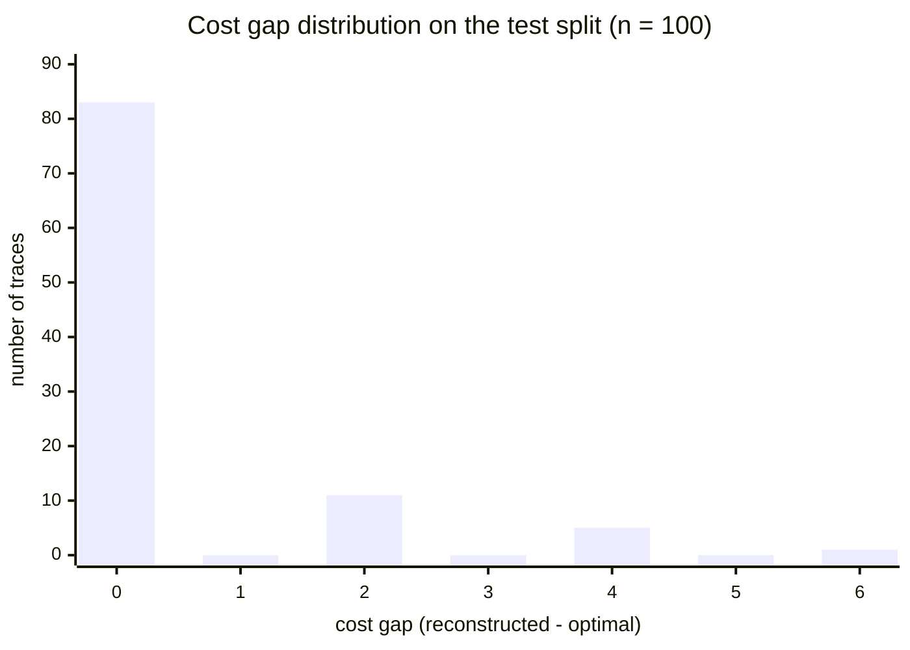
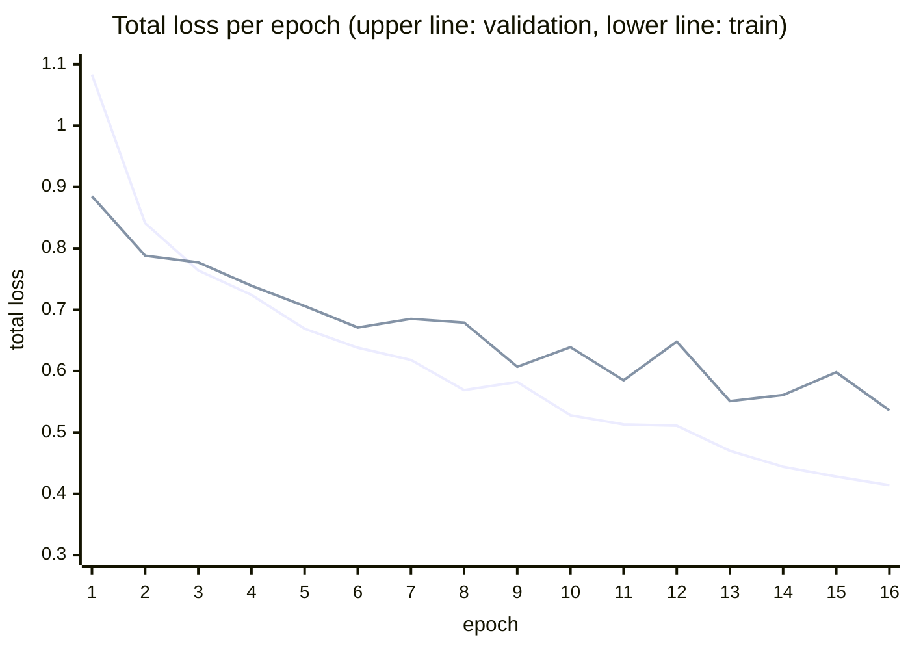

# Assessment: Training and Test Results

This document defines the evaluation metrics and reports the results of the
reference training run and the held-out test evaluation. All numbers are
reproducible from the repository artifacts: `runs/lara/metrics.csv` (training),
`runs/lara/best.pt` + `scripts/test_model.py` (test), and the dataset described
in `approach.md` §6. The test split contains 100 stratified examples
(82 sequence, 18 duplicate-label choice) never seen during training.

## 1. Evaluation Protocol

- **Checkpoint:** `runs/lara/best.pt` (best validation loss, epoch 16).
- **Mode:** the learned method is evaluated in *fast* mode (verified neural
  candidate only), so no exact repair contaminates the learned metrics. The
  pm4py state-equation A* optimum serves as ground truth for every sample.
- **Hardware:** single CPU; evaluating the full test split takes ≈ 1.8 s.

### Metric Definitions

| metric | definition | research question |
|---|---|---|
| replayable rate | share of candidates that are *legal*: model projection fires from $m_0$ to $m_f$ and log projection reconstructs $\sigma$ | RQ1 |
| optimal-cost rate | share of candidates with $c(\gamma) = \delta(\sigma, SN)$ | RQ2 |
| exact transition-sequence match | candidate identical to the pm4py alignment at *transition-identity* level | RQ3 |
| label-level alignment match | candidate identical after projecting moves to labels | RQ3 |
| cost gap | $c(\gamma) - \delta(\sigma, SN)$ for legal candidates (mean, median, p90, p95, max, std; relative gap divides by $\max(1, \delta)$) | RQ2 |
| per-family breakdown | all of the above per synthetic family | RQ4 |
| certified-optimal rate | share of candidates certified by cost equality against the exact backend | RQ5 |

## 2. Headline Results (test split, n = 100)

| metric | value |
|---|---:|
| **replayable (legal) alignments** | **100.0%** |
| **equal to optimum cost** | **83.0%** |
| certified optimal (cost equality vs. exact) | 83.0% |
| exact transition-sequence match | 63.0% |
| same label-level alignment | 63.0% |
| mean cost gap | 0.48 |
| median cost gap | 0.00 |
| p90 / p95 cost gap | 2.0 / 4.0 |
| max cost gap | 6 |
| cost gap std dev | 1.17 |
| mean relative gap | 0.285 |

Every candidate produced by the constrained greedy decoder was legal — the
bounded-search decoding plus replay verification eliminated illegal outputs
entirely (RQ1). In 83% of cases the candidate already attains the exact
optimum and is therefore certified without repair (RQ2, RQ5); the remaining
17% require exact repair in certified mode.

## 3. Cost-Gap Distribution

The distribution of $c(\gamma) - \delta$ over the 100 legal candidates:

| cost gap | 0 | 2 | 4 | 6 |
|---|---:|---:|---:|---:|
| traces | 83 | 11 | 5 | 1 |

Two observations. First, the distribution is sharply concentrated at zero with
a short tail. Second, **all non-zero gaps are even**: the decoder's
characteristic error is committing to a model-move detour past $k$ events that
the optimal alignment synchronizes, which converts $k$ zero-cost synchronous
moves into $k$ model moves *plus* $k$ log moves — a penalty of exactly $2k$.
This is a structural signature of the greedy decoder, not of the neural scores
(Section 7).

## 4. Results by Synthetic Family

| family | n | replayable | optimal cost | mean gap | gap histogram |
|---|---:|---:|---:|---:|---|
| sequence | 82 | 100.0% | 86.6% | 0.44 | 0: 71, 2: 5, 4: 5, 6: 1 |
| duplicate-label choice | 18 | 100.0% | 66.7% | 0.67 | 0: 12, 2: 6 |

Legality is family-independent, but optimality is not: duplicate-label choice
nets are markedly harder (66.7% vs. 86.6% optimal), confirming that
label-to-transition ambiguity is the dominant remaining difficulty (RQ3, RQ4).
Notably, the duplicate-label errors are all small (gap 2): the model picks the
wrong branch, pays one wrong-branch penalty, and still recovers a legal
alignment. Larger gaps (4–6) occur only on longer sequence traces where one
early greedy detour cascades.

## 5. Training Dynamics

The reference run: 16 recorded epochs, ≈ 32 s/epoch on CPU (≈ 8.7 min total),
AdamW at $5 \times 10^{-4}$ (never reduced by the plateau scheduler), best
validation total loss **0.5364** at epoch 16.

*(The smooth monotone curve is the training loss; the noisier curve above it is
the validation loss.)*

Selected epochs:

| epoch | train total | val total | val move | val cost | lr | best val |
|---:|---:|---:|---:|---:|---|---:|
| 1 | 1.083 | 0.885 | 0.850 | 0.863 | 5e-4 | 0.885 |
| 4 | 0.724 | 0.739 | 0.726 | 0.383 | 5e-4 | 0.739 |
| 8 | 0.569 | 0.679 | 0.666 | 0.371 | 5e-4 | 0.671 |
| 12 | 0.511 | 0.648 | 0.635 | 0.388 | 5e-4 | 0.585 |
| 16 | 0.414 | **0.536** | 0.529 | 0.196 | 5e-4 | **0.536** |

The train/val gap stays modest (0.41 vs. 0.54 at epoch 16) and validation was
still improving when the run ended, indicating the model is not yet
overfitting the 400-example corpus — consistent with dropout 0.25 and weight
decay on a 2.9M-parameter model, and suggesting headroom from longer training
and more data.

**Validation loss decomposition at the best epoch** (epoch 16): sync-move
0.073, log-move 0.302, model-move 0.154, cost 0.196. The log-move head is the
hardest objective — deciding *which* events are deviations is intrinsically
ambiguous under random insertions that duplicate legitimate labels.

> **Artifact worth noting before publication:** the recorded validation
> sync-move loss is bit-identical (0.0728) across all 16 epochs, while the
> training sync-move loss varies normally. This should be investigated (and
> the number re-measured) before quoting per-component validation curves; the
> test-split sync loss of 0.066 from the independent evaluator is consistent
> with a genuinely low, near-saturated sync objective.

## 6. Test-Split Losses

Component losses of the best checkpoint on the held-out test split (from
`scripts/test_model.py`), confirming the validation picture transfers:

| loss | test value |
|---|---:|
| sync move | 0.066 |
| log move | 0.333 |
| model move | 0.180 |
| cost | 0.200 |
| router balance / boundary / entropy | 0.027 / 0.055 / 0.821 |
| **total** | **0.586** |

## 7. Runtime

Per-trace wall-clock on the test split (CPU, single-threaded):

| method | mean | median | p95 | max | total (100 traces) |
|---|---:|---:|---:|---:|---:|
| LARA fast (encode + decode + verify) | 8.40 ms | 5.75 ms | 15.44 ms | 67.5 ms | 0.84 s |
| pm4py exact (state-equation A*) | 0.96 ms | 0.86 ms | 1.69 ms | 1.96 ms | 0.10 s |

An honest reading: **on these small synthetic nets (3–9 transitions), exact
search is roughly 9× faster than the neural fast path.** The neural forward
pass dominates LARA's cost, while A* barely searches at all at this scale. The
hypothesized speed benefit of learned guidance applies to the regime where
exact search degrades — concurrency, loops, duplicate labels, and long traces —
which the current synthetic families do not yet reach. The claim these
experiments *do* support is a quality/trust claim (legal, mostly-optimal
candidates plus certification), not a speed claim; establishing the speed
crossover requires the harder model families listed as future work.

## 8. Qualitative Failure Analysis

The five largest-gap test cases share one pattern. Example (`test-000074`,
gap 6): trace `A E B C D E F G` against an 8-step sequence net. The optimum
skips the two spurious events (cost 2). LARA instead explains the early
spurious `E` by *fast-forwarding the model* through `B, C, D` as model moves to
synchronize with it, then must emit the genuinely observed `B C D` (and the
second `E`) as log moves — a legal alignment of cost 8.

The root cause is decoding-time myopia, not representation failure: the greedy
decoder makes an irrevocable local choice between "synchronize now via a model
path" and "emit a log move", and its bounded lookahead cannot see that the
skipped events reappear later in the trace. This directly motivates the planned
replacement of greedy decoding with neural-guided beam or A* search over the
synchronous product, where the same learned scores rank *paths* rather than
single moves.

## 9. Summary Against the Research Questions

| RQ | question | finding |
|---|---|---|
| RQ1 | legality of neural-guided decoding | **100%** replayable candidates on test |
| RQ2 | near-optimality | **83%** exactly optimal; mean gap 0.48, p95 = 4, max 6; all gaps even (greedy-detour signature) |
| RQ3 | duplicate labels / invisible transitions | transition-identity match 63%; duplicate-label family optimal-cost rate 66.7% vs. 86.6% for sequences — ambiguity is the main residual error source, but always with small (gap-2) penalties |
| RQ4 | generalization across families/splits | legality transfers perfectly across families and splits; optimality degrades gracefully on the harder family; val→test loss transfer is tight (0.536 → 0.586) |
| RQ5 | certification | **83%** of candidates certified optimal by cost equality; 17% need exact repair; certification adds one exact call (~1 ms/trace at this scale) |

**Overall:** the prototype validates the architecture's core promise — a
learned model can produce *legal* alignments essentially always and *optimal*
ones in the large majority of cases, with a certifying exact layer covering the
rest — while clearly delimiting what is not yet shown: wall-clock advantage
over exact search, and robustness on process models with concurrency and loops.
