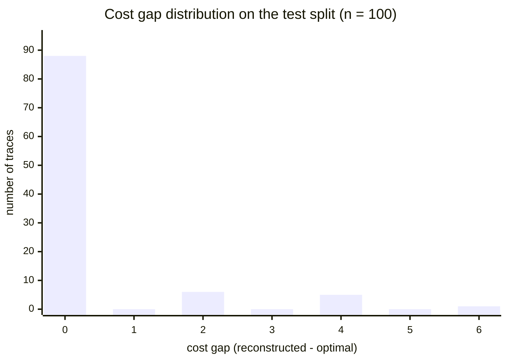
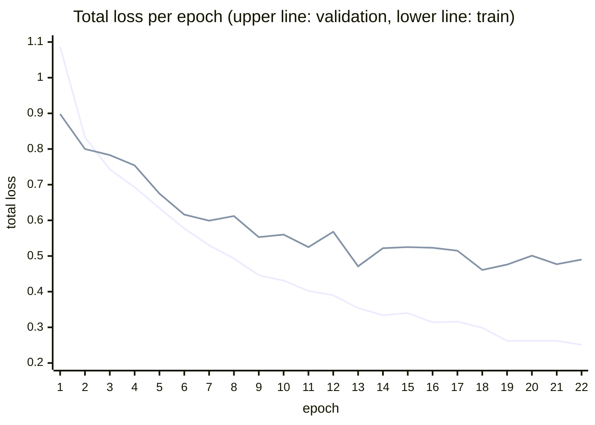
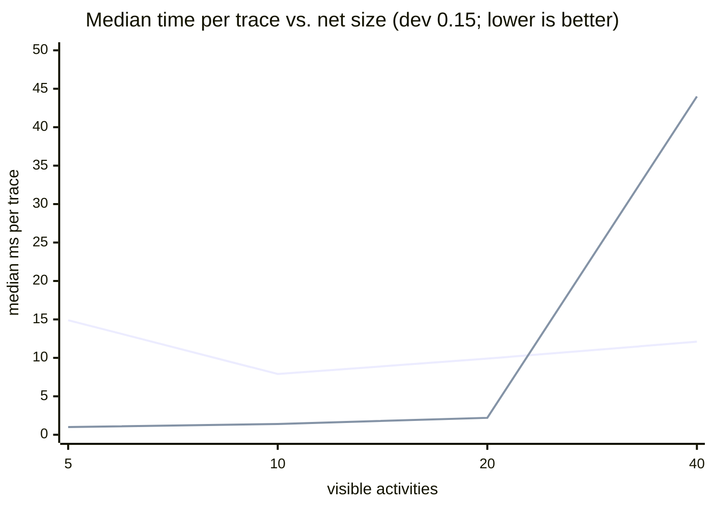

# Assessment: Training and Test Results

This document defines the evaluation metrics and reports the results of the
reference training run and the held-out test evaluation. All numbers are
reproducible from the repository artifacts: `runs/lara_bidir/metrics.csv`
(training), `runs/lara_bidir/best.pt` + `scripts/test_model.py` (test),
`runs/lara_bidir/scaling*.json` + `scripts/benchmark_scaling.py` (scaling and
ablation), `runs/lara_bidir/real_*.json` + `scripts/evaluate_real_log.py`
(real-life logs), and the dataset described in `approach.md` §6. The test split contains 100
stratified examples (82 sequence, 18 duplicate-label choice) never seen during
training.

## 1. Evaluation Protocol

- **Checkpoint:** `runs/lara_bidir/best.pt` (best validation loss, epoch 18;
  trained with bidirectional typed edges, see `approach.md` §2).
- **Mode:** the learned method is evaluated in *fast* mode (verified neural
  candidate only), so no exact repair contaminates the learned metrics. The
  pm4py state-equation A* optimum serves as ground truth for every sample.
- **Hardware:** single CPU; evaluating the full test split takes ≈ 1.8 s.

### Metric Definitions

| metric | definition | research question |
|---|---|---|
| replayable rate | share of candidates that are *legal*: model projection fires from $m_0$ to $m_f$ and log projection reconstructs $\sigma$ | RQ1 |
| optimal-cost rate | share of candidates with $c(\gamma) = \delta(\sigma, SN)$ | RQ2 |
| exact transition-sequence match | candidate identical to the pm4py alignment at *transition-identity* level | RQ3 |
| label-level alignment match | candidate identical after projecting moves to labels | RQ3 |
| cost gap | $c(\gamma) - \delta(\sigma, SN)$ for legal candidates (mean, median, p90, p95, max, std; relative gap divides by $\max(1, \delta)$) | RQ2 |
| per-family breakdown | all of the above per synthetic family | RQ4 |
| certified-optimal rate | share of candidates certified by cost equality against the exact backend | RQ5 |

## 2. Headline Results (test split, n = 100)

| metric | value |
|---|---:|
| **replayable (legal) alignments** | **100.0%** |
| **equal to optimum cost** | **88.0%** |
| certified optimal (cost equality vs. exact) | 88.0% |
| exact transition-sequence match | 68.0% |
| same label-level alignment | 68.0% |
| mean cost gap | 0.38 |
| median cost gap | 0.00 |
| p90 / p95 cost gap | 2.0 / 4.0 |
| max cost gap | 6 |
| cost gap std dev | 1.12 |
| mean relative gap | 0.185 |

Every candidate produced by the constrained greedy decoder was legal — the
bounded-search decoding plus replay verification eliminated illegal outputs
entirely (RQ1). In 88% of cases the candidate already attains the exact
optimum and is therefore certified without repair (RQ2, RQ5); the remaining
12% require exact repair in certified mode.

## 3. Cost-Gap Distribution

The distribution of $c(\gamma) - \delta$ over the 100 legal candidates:

| cost gap | 0 | 2 | 4 | 6 |
|---|---:|---:|---:|---:|
| traces | 88 | 6 | 5 | 1 |

Two observations. First, the distribution is sharply concentrated at zero with
a short tail. Second, **all non-zero gaps are even**: the decoder's
characteristic error is committing to a model-move detour past $k$ events that
the optimal alignment synchronizes, which converts $k$ zero-cost synchronous
moves into $k$ model moves *plus* $k$ log moves — a penalty of exactly $2k$.
This is a structural signature of the greedy decoder, not of the neural scores
(Section 7).

## 4. Results by Synthetic Family

| family | n | replayable | optimal cost | mean gap | gap histogram |
|---|---:|---:|---:|---:|---|
| sequence | 82 | 100.0% | 86.6% | 0.44 | 0: 71, 2: 5, 4: 5, 6: 1 |
| duplicate-label choice | 18 | 100.0% | 94.4% | 0.11 | 0: 17, 2: 1 |

Legality is family-independent, and the duplicate-label family is the
strongest (94.4% optimal, a single gap-2 miss): thanks to bidirectional typed
message passing (`approach.md` §2), the disambiguating suffix context reaches
the twin transitions and the sync head resolves transition identity almost
perfectly (RQ3). The residual errors are concentrated in longer sequence
traces where one early greedy detour cascades (gaps 4–6), which is a
decoding-search limitation, not a representation one (§10).

## 5. Training Dynamics

The reference run: 22 recorded epochs (stopped manually), ≈ 32 s/epoch on CPU,
AdamW at $5 \times 10^{-4}$ (never reduced by the plateau scheduler), best
validation total loss **0.4614** at epoch 18.

*(The smooth monotone curve is the training loss; the noisier curve above it is
the validation loss.)*

The train/val gap stays modest (0.30 vs. 0.46 at epoch 18), indicating the
model is not yet overfitting the 400-example corpus — consistent with dropout
0.25 and weight decay on a 3M-parameter model, and suggesting headroom from
longer training and more data.

**Validation loss decomposition at the best epoch** (epoch 18): sync-move
0.025, log-move 0.298, model-move 0.130, cost 0.234. The log-move head is
the hardest objective — deciding *which* events are deviations is
intrinsically ambiguous under random insertions that duplicate legitimate
labels.

## 6. Test-Split Losses

Component losses of the best checkpoint on the held-out test split (from
`scripts/test_model.py`), confirming the validation picture transfers:

| loss | test value |
|---|---:|
| sync move | 0.0001 |
| log move | 0.308 |
| model move | 0.160 |
| cost | 0.217 |
| router balance / boundary / entropy | 0.027 / 0.075 / 0.880 |
| **total** | **0.476** |

## 7. Runtime and the Speed/Quality Threshold

### 7.1 Runtime profile of the fast path

Per trace, fast mode pays (i) feature extraction, (ii) one neural forward pass
— ~3–7 ms on CPU, dominated by per-op overhead on small tensors rather than
FLOPs — and (iii) the greedy decoder's bounded marking search plus one replay
verification. The decoder keeps the search term mild in net size by
precomputing a per-net runtime before the walk: indexed presets/postsets,
place-to-consumer lists so that only transitions consuming from currently
marked places are tested for enabledness, zero-free dict markings, and neural
scores extracted once into Python floats (`approach.md` §4). The certifier
reuses the decoder's verification, so each candidate is replayed exactly once.
As a result, the forward pass is the dominant fixed cost, and total fast-mode
time stays in the 8–12 ms range across the full benchmark ladder below.

### 7.2 Small nets: exact search wins

On the tiny test-split nets (3–9 transitions), pm4py's A* is faster:
LARA fast averages 9.2 ms/trace (the forward pass floor) versus ~1 ms for
exact search, which barely has to search at this scale. Small models are not
the target regime for learned guidance.

### 7.3 Scaling benchmark: the crossover appears at ~40 activities

`scripts/benchmark_scaling.py` generates random block-structured nets (nested
sequence/XOR/AND/loop blocks, invisible routing transitions, duplicate labels
via a compressed alphabet), injects deviations, and times both methods per
trace (10 samples per configuration, 30 s exact timeout, sizes up to 40
activities):

| size | dev | \|T\| | trace | legal | optimal | mean gap | fast med | exact med | speedup | timeouts |
|---:|---:|---:|---:|---:|---:|---:|---:|---:|---:|---:|
| 5 | 0.15 | 7 | 4 | 100% | 80% | 0.3 | 14.9 ms | 1.0 ms | 0.07× | 0 |
| 5 | 0.35 | 6 | 6 | 100% | 60% | 1.6 | 7.7 ms | 1.1 ms | 0.14× | 0 |
| 10 | 0.15 | 13 | 7 | 100% | 80% | 1.2 | 7.9 ms | 1.4 ms | 0.17× | 0 |
| 10 | 0.35 | 13 | 7 | 100% | 40% | 1.8 | 8.9 ms | 1.9 ms | 0.21× | 0 |
| 20 | 0.15 | 28 | 10 | 100% | 60% | 3.6 | 9.9 ms | 2.2 ms | 0.22× | 0 |
| 20 | 0.35 | 26 | 16 | 100% | 50% | 3.0 | 9.6 ms | 9.2 ms | 0.96× | 0 |
| 40 | 0.15 | 55 | 31 | 100% | 30% | 8.4 | 12.1 ms | 44.0 ms | **3.65×** | 0 |
| 40 | 0.35 | 54 | 23 | 100% | 33% | 11.6 | 12.0 ms | 15.5 ms | **1.29×** | 1 |

*(Flat line: LARA fast. Steep line: pm4py exact A*.)*

Three findings. First, **LARA's cost scales gently** (median 8–12 ms across
the whole ladder — the forward pass floor plus a mild search term) while
**exact A\* degrades super-linearly** once concurrency, loops, and deviations
interact; the crossover sits at roughly 40 activities at both deviation
levels, and exact search already produces occasional 30 s timeouts there
(counted at the timeout in the medians). A probe at 80 activities showed the
trend continuing (7–12× median speedup, with timeouts). Second, **legality is
scale-invariant**: 100% replayable candidates at every size, on families the
model was *never trained on*. Third, **quality does not transfer at scale**:
the optimal-cost rate falls from ~80% on training-scale nets to ~30% at 40
activities with large gaps, because the checkpoint was trained exclusively on
3–9-transition sequence/choice nets. The speed threshold is therefore
established, but exploiting it requires training on the block-structured
family itself — the generator already exists, so this is a data problem, not
an architecture problem.

## 8. Ablation: How Much Does Neural Guidance Contribute?

Because the decoder guarantees legality by construction, a natural question is
whether the *learned* component matters at all, or whether the constrained
greedy search is doing all the work. We therefore re-ran both evaluations with
neural guidance disabled (`--no-guidance` in `scripts/test_model.py` and
`scripts/benchmark_scaling.py`): the decoder receives no sync/model-move
scores and falls back to purely structural heuristics (prefer invisible
transitions, then deterministic name order). Both variants see identical
inputs; the guided run pays one neural forward pass per trace, the unguided
run pays none.

### 8.1 In distribution (test split, n = 100)

| metric | unguided | guided | Δ |
|---|---:|---:|---:|
| replayable | 100.0% | 100.0% | — |
| equal to optimum cost | 83.0% | **88.0%** | +5.0 |
| exact transition-sequence match | 63.0% | **68.0%** | +5.0 |
| mean cost gap | 0.48 | **0.38** | −0.10 |
| sequence family, optimal | 86.6% | 86.6% | 0.0 |
| duplicate-label family, optimal | 66.7% | **94.4%** | **+27.7** |
| evaluation time (100 traces) | 1.0 s | 1.9 s | +0.9 s |

The decomposition is clean: on sequence nets — where every event has at most
one label-compatible transition — guidance changes *nothing* (86.6% either
way; the residual errors are greedy-search myopia, §10). The model's entire
in-distribution contribution is concentrated exactly where the architecture
predicts it should be: resolving duplicate-label transition identity, where
guided decoding recovers +27.7 points (94.4% vs. 66.7%). Structural
tie-breaking cannot know which branch the trace suffix implies; the sync head
can, and almost perfectly.

### 8.2 Out of distribution (scaling benchmark, same generator seeds)

| size | dev | optimal (unguided) | optimal (guided) | fast med (unguided) | fast med (guided) |
|---:|---:|---:|---:|---:|---:|
| 5 | 0.15 | 90% | 80% | 0.2 ms | 14.9 ms |
| 10 | 0.15 | 80% | 80% | 0.3 ms | 7.9 ms |
| 20 | 0.15 | 50% | 60% | 0.4 ms | 9.9 ms |
| 40 | 0.15 | 30% | 30% | 1.1 ms | 12.1 ms |
| 5 | 0.35 | 60% | 60% | 0.2 ms | 7.7 ms |
| 10 | 0.35 | 50% | 40% | 0.3 ms | 8.9 ms |
| 20 | 0.35 | 60% | 50% | 0.6 ms | 9.6 ms |
| 40 | 0.35 | 44% | 33% | 1.0 ms | 12.0 ms |

On the block-structured family — which the checkpoint never saw in training —
guidance provides *no measurable quality benefit*: per-configuration
differences are within sampling noise at $n = 10$ (one trace = 10 points),
and both variants are 100% legal everywhere. Meanwhile the unguided decoder
skips the neural forward pass, which is the entire fast-path floor, and runs
at 0.2–1.1 ms/trace — overtaking exact search at *every* tested size (up to
34× at size 40) rather than only beyond the ~40-activity crossover.

### 8.3 Implications

The ablation sharpens the paper's claims in three ways. First, the learned
model's contribution is real, targeted, and architecturally explainable —
duplicate-label identity resolution, the hardest sub-problem for classical
heuristics — rather than a diffuse improvement that might be an artifact of
the search. Second, it exposes the honest baseline for the speed argument:
the constrained greedy decoder *alone* is already a legal, fast, surprisingly
strong heuristic aligner, so the neural model must justify its ~8–12 ms
forward pass by quality it uniquely provides. In distribution it does (on
duplicate labels); out of distribution it does not yet, because nothing in
the training data resembles those nets. Third, it turns the future-work claim
into a falsifiable target: training on the block-structured family must lift
the guided curve in §8.2 measurably above the unguided one — the metric and
the baseline are now both in place.

## 9. Zero-Shot Validation on Real-Life Event Logs

All preceding results use synthetic data. To test external validity, we
evaluated the same checkpoint — with no fine-tuning — on two real-life event
logs (`scripts/evaluate_real_log.py`): the **receipt phase** log of a Dutch
municipality's building-permit process (1,434 traces, 116 variants, 27
activity labels, traces up to 25 events) and the **road traffic fine
management** log sample (100 traces, 10 variants, 10 labels). For each log a
Petri net is discovered with the inductive miner at two noise thresholds:
0.0 (a perfectly fitting model, so every optimal cost is 0 and the task
isolates *navigation* of the discovered net) and 0.5 (a filtered model, so
frequent behavior fits but rarer variants genuinely deviate). Alignment is
computed once per variant and metrics are reported both per variant and
weighted by trace frequency. This setting is a strict zero-shot test: the
activity labels were never seen in training (they embed via the label hash),
and inductive-miner nets are dominated by invisible routing transitions —
e.g., 47 invisible vs. 27 visible transitions for the fitting receipt model —
a structure far from the training distribution.

| log | noise | net (P / vis+inv T) | legal | optimal (variant) | optimal (trace-wtd) | gap mean / max | LARA med | unguided med | exact med (max) |
|---|---:|---|---:|---:|---:|---|---:|---:|---:|
| road traffic | 0.0 | 15 / 10+10 | 100% | 100.0% | 100.0% | 0 / 0 | 8.0 ms | 0.4 ms | 1.7 ms (62) |
| road traffic | 0.5 | 13 / 10+7 | 100% | 70.0% | 94.0% | 0.50 / 3 | 7.9 ms | 0.4 ms | 1.3 ms (51) |
| receipt | 0.0 | 45 / 27+47 | 100% | 50.0% | 82.6% | 0.76 / 5 | 18.5 ms | 6.1 ms | 27.4 ms (558) |
| receipt | 0.5 | 25 / 24+19 | 100% | 55.2% | 74.6% | 0.82 / 7 | 8.9 ms | 0.6 ms | 8.1 ms (76) |

Four observations.

**Legality transfers perfectly.** 100% of variants (hence 100% of traces)
yield replayable alignments on every configuration — on nets riddled with
invisible transitions and with activity labels the model never saw. Combined
with the synthetic results, RQ1 now holds across three distributions
(training families, block-structured stress nets, real-life logs).

**Optimality is strong on frequent behavior, weaker in the tail.**
Trace-weighted optimal rates (74.6–100%) sit well above variant-level rates
(50–100%): the variants that matter most align optimally, while the misses
concentrate in rare, long variants (up to 25 events) where the greedy decoder
occasionally pays a small detour (mean gap ≤ 0.82, max 7). On the fitting
receipt net every optimal cost is 0, so the 82.6% trace-weighted optimal rate
means LARA replays most real behavior through a 47-invisible-transition net
without any deviation — and its errors are bounded upper estimates, never
illegal answers.

**The real-life speed picture matches the synthetic threshold.** On the small
road-traffic nets, exact A* is faster — as predicted for that size class. On
the largest discovered net (receipt, noise 0.0), LARA fast overtakes exact
search *on a real log*: median 18.5 ms vs. 27.4 ms (1.5×) and, more
importantly for tail latency, max 123 ms vs. 558 ms (4.5×). The unguided
variant is faster still (median 6.1 ms, 4.5× over exact). Invisible-heavy
discovered models are exactly the regime where the synchronous product blows
up, and it is the regime real process discovery produces.

**Guided and unguided quality are identical here — as the ablation predicts.**
Inductive-miner nets contain no duplicate labels, which §8 identified as the
one sub-problem where the current checkpoint's guidance pays off. Real-life
validation therefore currently showcases the constrained decoder and the
certification architecture; label-ambiguous real models (e.g., from region
discovery or hand-made models with repeated activities) are where guidance
should differentiate, and duplicate-label-rich training data remains the
lever for the rest.

## 10. Qualitative Failure Analysis

The five largest-gap test cases share one pattern. Example (`test-000074`,
gap 6): trace `A E B C D E F G` against an 8-step sequence net. The optimum
skips the two spurious events (cost 2). LARA instead explains the early
spurious `E` by *fast-forwarding the model* through `B, C, D` as model moves to
synchronize with it, then must emit the genuinely observed `B C D` (and the
second `E`) as log moves — a legal alignment of cost 8.

The root cause is decoding-time myopia, not representation failure: the greedy
decoder makes an irrevocable local choice between "synchronize now via a model
path" and "emit a log move", and its bounded lookahead cannot see that the
skipped events reappear later in the trace. This directly motivates the planned
replacement of greedy decoding with neural-guided beam or A* search over the
synchronous product, where the same learned scores rank *paths* rather than
single moves.

## 11. Summary Against the Research Questions

| RQ | question | finding |
|---|---|---|
| RQ1 | legality of neural-guided decoding | **100%** replayable candidates on test, at every scale of the benchmark ladder, and on both real-life logs (zero-shot, §9) — three distinct distributions |
| RQ2 | near-optimality | **88%** exactly optimal; mean gap 0.38, p95 = 4, max 6; all gaps even (greedy-detour signature) |
| RQ3 | duplicate labels / invisible transitions | the duplicate-label family reaches **94.4%** optimal with test sync loss ≈ 0.0001, versus 66.7% for the unguided ablation (§8) — identity resolution is essentially solved at training scale, and it is specifically the *learned* component that solves it |
| RQ4 | generalization across families/splits | legality transfers perfectly across families, splits, scales, and real logs; optimality transfers well to real frequent behavior (74.6–100% trace-weighted, §9) but not to large synthetic stress nets (~30% at 40 activities), making broader training data the clear next step |
| RQ5 | certification | **88%** of candidates certified optimal by cost equality; 12% need exact repair; certification adds one exact call (~1 ms/trace at training scale) |

**Overall:** the prototype validates the architecture's core promise — a
learned model can produce *legal* alignments essentially always — including
zero-shot on real-life logs — resolve duplicate-label ambiguity nearly
perfectly (and measurably beyond what unguided search achieves, §8), and
attain the exact optimum in the large majority of in-distribution cases, with
a certifying exact layer covering the rest. The fast path overtakes exact
search at ~40 activities on synthetic nets and already on the
invisible-transition-heavy discovered model of the real receipt log (1.5×
median, 4.5× worst-case, §9); the remaining gap is *quality at scale*, a
training-data problem for which the block-structured generator provides the
pipeline and the unguided ablation provides the baseline to beat.

## Cost-estimate evaluation (added 2026-07-07)

`scripts/evaluate_cost_estimate.py --checkpoint runs/lara_bidir/best.pt` on the
held-out test split (n = 100); artifact: `runs/lara_bidir/cost_estimate_test.json`.
Summed regional upper bounds vs. exact optimal cost: MAE 0.495, mean signed
error -0.271 (slight underestimation), Pearson r 0.888. Interval
[sum lower, sum upper]: mean width 0.468, coverage of the true optimum 22%.
Mean estimate 0.195 on fitting traces (delta = 0) vs. 1.726 on deviating ones;
thresholding the estimate at 0.5 classifies "trace deviates" with 93% accuracy.
