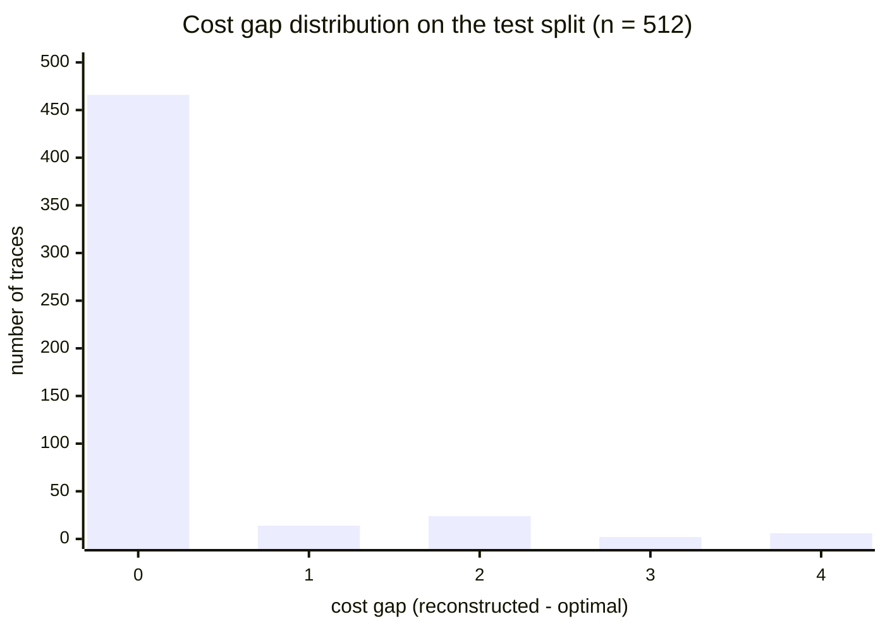
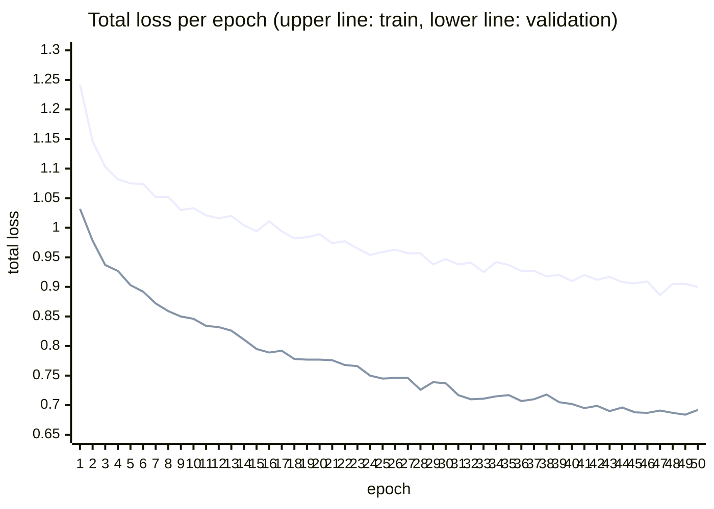

# Assessment: Training and Test Results

This document reports the results of the current reference checkpoint and the
base experiments used by `paper/main.tex`. All numbers below are reproducible
from local result artifacts and scripts:

For an experimental comparison between LARA and the approximate alignment
variants available in PM4Py 2.7.23.2, see
`pm4py_approx_alignment_comparison.md`.

- training: `runs/lara/metrics.csv`
- checkpoint: `runs/lara/best.pt`
- held-out test: `runs/lara/test_guided.json`,
  `runs/lara/test_unguided.json`, `scripts/test_model.py`
- cost estimate: `runs/lara/cost_estimate_test.json`,
  `scripts/evaluate_cost_estimate.py`
- scaling: `runs/lara/scaling_guided.json`,
  `runs/lara/scaling_unguided.json`, `scripts/benchmark_scaling.py`
- real-life logs: `runs/lara/real_*.json`, `scripts/evaluate_real_log.py`
- dataset: `data/lara_synthetic/metadata.json` and `approach.md` §6

The held-out test split contains 512 samples from 128 behavior families, with
balanced support for four motifs: ordinary tree/isomorphic renaming,
duplicate-prefix/silent routing, parallel/explicit interleaving, and canonical
block/M-pattern non-free-choice.

## 1. Evaluation Protocol

- **Checkpoint:** `runs/lara/best.pt`, epoch 49, validation total loss 0.6839.
- **Mode:** LARA is evaluated in *fast* mode unless stated otherwise. Fast mode
  returns the replay-verified candidate only, so exact repair does not
  contaminate the learned metrics.
- **Ground truth:** the pm4py state-equation A* optimum stored in the dataset
  serves as the exact optimal cost and teacher alignment.
- **Hardware:** single CPU. The full guided test evaluation takes 11.3 s with
  certified-mode reruns enabled; the unguided ablation takes 4.8 s.

### Metric Definitions

| metric | definition | research question |
|---|---|---|
| replayable rate | share of candidates that are legal: model projection fires from $m_0$ to $m_f$ and log projection reconstructs $\sigma$ | RQ1 |
| optimal-cost rate | share of fast candidates with $c(\gamma) = \delta(\sigma, SN)$; this is also the share certified without exact repair by cost equality | RQ2, RQ5 |
| exact transition-sequence match | candidate identical to the pm4py alignment at transition-identity level | RQ3 |
| label-level alignment match | candidate identical after projecting moves to labels | RQ3 |
| cost gap | $c(\gamma) - \delta(\sigma, SN)$ for legal candidates | RQ2 |
| paired-equivalence metrics | consistency across equivalent representations of the same behavior and trace | RQ4 |
| guidance delta | guided fast mode minus unguided constrained decoding on the same inputs | RQ6 |

## 2. Headline Results (test split, n = 512)

| metric | value |
|---|---:|
| **replayable (legal) alignments** | **100.0%** |
| **equal to optimum cost / certified without repair** | **91.0%** |
| exact transition-sequence match | 61.1% |
| same label-level alignment | 62.5% |
| mean cost gap | 0.180 |
| median cost gap | 0.000 |
| p90 / p95 cost gap | 0.0 / 2.0 |
| max cost gap | 4 |
| cost gap std dev | 0.637 |
| mean relative gap | 0.108 |

Every candidate was legal. In 466 of 512 cases the fast candidate already
attains the exact optimal cost and is therefore certified without repair by
cost equality. The remaining 46 cases remain legal upper bounds in fast mode
and are repaired exactly in certified mode.

## 3. Cost-Gap Distribution

Distribution of $c(\gamma)-\delta$ over the 512 legal test candidates:

| cost gap | 0 | 1 | 2 | 3 | 4 |
|---|---:|---:|---:|---:|---:|
| traces | 466 | 14 | 24 | 2 | 6 |

The tail is short: 95% of candidates are at most two cost units above optimum,
and no gap exceeds four. Because the behavior-family corpus mixes several
motifs, it produces both odd and even gaps: failures combine visible model
moves, log moves, and routing detours rather than only paired model/log
fast-forward errors.

## 4. Fixed-Checkpoint Results by Model Class and Representation

This analysis uses only the existing epoch-49 checkpoint. No model was retrained.
Guided and unguided decoding were rerun on the same 512 held-out rows and the
same exact teacher alignments. Each representation cell contains 64 rows from
32 behavior families and two traces per family. Uncertainty for the guidance
delta is a percentile 95% interval from 10,000 bootstrap resamples of whole
behavior families, not individual rows. `id.` is event-anchored concrete
transition identity accuracy on teacher-synchronous event positions in samples
where identity is marked identifiable. Timing columns are median milliseconds
per trace for guided fast decoding and the stored exact A* labeling run.

Every cell remains 100% replayable, so legality is omitted from the table.

| motif | representation | guided opt. | unguided opt. | delta pp [family 95% CI] | guided gap mean / p95 | id. (events) | median ms LARA / A* |
|---|---|---:|---:|---:|---:|---:|---:|
| ordinary tree | canonical block | 84.4% | 85.9% | -1.6 [-4.7, 0.0] | 0.344 / 2 | 72.6% (208) | 1.77 / 0.76 |
| ordinary tree | isomorphic renaming | 84.4% | 76.6% | +7.8 [1.6, 15.6] | 0.344 / 2 | 63.0% (208) | 1.74 / 0.63 |
| duplicate / silent | duplicate prefix | 95.3% | 68.8% | **+26.6 [17.2, 34.4]** | 0.094 / 0 | 95.7% (164) | 1.46 / 0.57 |
| duplicate / silent | silent routing | 98.4% | 98.4% | 0.0 [0.0, 0.0] | 0.031 / 0 | 94.8% (194) | 1.53 / 0.58 |
| concurrency | parallel | 90.6% | 90.6% | 0.0 [0.0, 0.0] | 0.219 / 2 | 86.8% (190) | 1.55 / 0.59 |
| concurrency | explicit interleaving | 90.6% | 90.6% | 0.0 [0.0, 0.0] | 0.219 / 2 | 83.7% (190) | 1.49 / 0.56 |
| M-pattern | canonical block | 92.2% | 92.2% | 0.0 [0.0, 0.0] | 0.094 / 1 | 92.9% (170) | 1.56 / 0.55 |
| M-pattern | non-free-choice | 92.2% | 92.2% | 0.0 [0.0, 0.0] | 0.094 / 1 | 93.5% (170) | 1.58 / 0.58 |

The ordinary-tree pair is central to interpreting the deltas. Guided
optimality is 84.4% on both the canonical net and its isomorphic rename, and
their guided candidate costs always agree. Unguided optimality is instead
85.9% on the canonical identifiers and 76.6% after renaming. Thus the -1.6
point canonical delta and +7.8 point renamed delta do not describe different
behavior: they expose a transition-name-order baseline that happens to be
slightly favorable on one numbering and substantially unfavorable on the
other. The observed canonical reduction has an interval that reaches zero.
Guidance does not beat the favorable canonical tie-break, but it removes that
identifier sensitivity across the pair.

Duplicate-prefix optimality separately gains 26.6 points, whereas silent
routing receives no gain: the decoder can traverse its invisible route
structurally, but choosing between same-label visible transitions requires
suffix-dependent evidence. Parallel versus explicit interleaving and canonical
versus non-free-choice M-pattern representations have identical cost
distributions in both modes.

| equivalent representation pair | paired traces | guided candidate-cost agreement | unguided agreement | guided optimality agreement |
|---|---:|---:|---:|---:|
| ordinary / isomorphic | 64 | 100.0% | 90.6% | 100.0% |
| duplicate prefix / silent routing | 64 | 96.9% | 70.3% | 96.9% |
| parallel / explicit interleaving | 64 | 100.0% | 100.0% | 100.0% |
| canonical / non-free-choice M | 64 | 100.0% | 100.0% | 100.0% |
| **all pairs** | **256** | **99.2% (254/256)** | **90.2% (231/256)** | **99.2% (254/256)** |

Thus the representation result is stronger than the aggregate family rates:
learned scores raise equivalent-representation candidate-cost agreement by
9.0 points while preserving 100% legality. The only two guided disagreements
are in the duplicate/silent pair. This supports behavioral rather than surface
topology transfer for the representations present in training, but it does not
establish transfer to unseen encodings.

The 46 non-optimal candidates are distributed unevenly: 20 belong to ordinary
trees, 12 to concurrency/interleaving, 10 to the M-pattern family, and only 4
to duplicate/silent routing. In the silent, concurrency, and M-pattern cells,
guided and unguided costs are equal row by row; their bootstrap intervals are
exactly [0, 0] for this empirical sample. The duplicate-prefix interval remains
far from zero after resampling whole families.

Transition identity is diagnostic rather than the certification criterion.
The isomorphically renamed trees reproduce only 63.0% of teacher-synchronous
transition identities, yet retain 84.4% optimality and 100% paired candidate-
cost agreement. Parallel and interleaved forms similarly differ in identity
(86.8% versus 83.7%) while agreeing exactly in cost. Multiple legal optimal
alignments can therefore lower teacher-identity agreement without lowering
candidate quality; replay and cost remain the behavioral criteria.

### Difficulty and interpretation limits

| motif | mean transitions in the two representations | mean trace length | mean optimum | mean edits |
|---|---:|---:|---:|---:|
| ordinary tree | 9.53 / 9.53 | 3.78 | 1.31 | 1.11 |
| duplicate / silent | 6.00 / 7.00 | 3.64 | 1.58 | 1.25 |
| concurrency | 6.00 / 6.00 | 3.64 | 1.70 | 1.38 |
| M-pattern | 7.00 / 7.00 | 3.44 | 1.55 | 1.39 |

Within each motif, the two representations share the same noisy traces and
exact costs, so their comparison controls trace length, deviation count, and
alignment difficulty. Across motifs, however, ordinary trees are larger and
structurally more varied. Their lower 84.4% rate is therefore descriptive, not
an isolated causal effect of the class. Likewise, this fixed-checkpoint study
shows where guidance helps but cannot show which training motif created that
ability. A leave-one-class-out study would require new training and was not
performed. The evidence supports the narrower claim that, for the existing
checkpoint and seen representation classes, learned guidance is useful chiefly
when a legal structural decoder faces trace-dependent transition ambiguity.

## 5. Training Dynamics

The reference run used 2,048 training samples and 512 validation samples. It
ran for 50 epochs on CPU at about 41 s/epoch. The best checkpoint is epoch 49:
validation total loss 0.6839, training total loss 0.9046, learning rate
$2.5 \times 10^{-4}$ after one plateau reduction.

Validation is lower than training because training uses dropout plus per-sample
label remapping, while validation uses the fixed labels. At the best epoch,
validation loss components are: sync 0.119, log 0.309, model 0.249, cost 0.213,
router balance/boundary/entropy 0.067/0.008/0.161.

## 6. Test-Split Losses

Component losses of the best checkpoint on the held-out test split:

| loss | test value |
|---|---:|
| sync move | 0.122 |
| log move | 0.287 |
| model move | 0.177 |
| cost | 0.244 |
| router balance / boundary / entropy | 0.063 / 0.007 / 0.176 |
| **total** | **0.594** |

## 7. Learned Cost Estimate

`scripts/evaluate_cost_estimate.py` compares the summed regional upper bounds
with the exact optimal cost on the same 512-sample test split.

| metric | value |
|---|---:|
| mean absolute error of $\Sigma$ upper bounds vs. $\delta$ | 0.509 |
| mean signed error | -0.154 |
| Pearson correlation with $\delta$ | 0.822 |
| mean estimate on fitting traces ($\delta = 0$) | 0.268 |
| mean estimate on deviating traces ($\delta > 0$) | 1.776 |
| deviation detection accuracy (threshold 0.5) | 89.8% |
| mean interval width ($\Sigma$ upper - $\Sigma$ lower) | 1.155 |
| interval coverage of $\delta$ | 29.1% |

The estimate is useful as a ranking and deviation-detection signal, but the
interval remains under-calibrated. This supports the design decision that
learned bounds are diagnostic only and never used as admissible heuristics.

## 8. Runtime and Scaling Benchmark

`scripts/benchmark_scaling.py` generates random block-structured stress nets
with sequence/XOR/AND/loop blocks, invisible routing, duplicate labels, and
deviations. It uses 10 samples per configuration and a 30 s exact timeout.

| size | dev | \|T\| | trace | legal | optimal | mean gap | fast med | exact med | speedup | timeouts |
|---:|---:|---:|---:|---:|---:|---:|---:|---:|---:|---:|
| 5 | 0.15 | 7 | 4.0 | 100% | 90% | 0.20 | 5.5 ms | 1.3 ms | 0.23× | 0 |
| 5 | 0.35 | 6 | 6.2 | 100% | 60% | 1.60 | 4.6 ms | 1.3 ms | 0.29× | 0 |
| 10 | 0.15 | 13 | 6.8 | 100% | 80% | 1.20 | 5.0 ms | 1.8 ms | 0.36× | 0 |
| 10 | 0.35 | 13 | 7.0 | 100% | 50% | 1.70 | 5.3 ms | 2.8 ms | 0.53× | 0 |
| 20 | 0.15 | 28 | 10.5 | 100% | 60% | 3.60 | 6.9 ms | 2.9 ms | 0.42× | 0 |
| 20 | 0.35 | 26 | 15.8 | 100% | 60% | 3.10 | 6.0 ms | 11.7 ms | **1.94×** | 0 |
| 40 | 0.15 | 55 | 30.9 | 100% | 30% | 8.10 | 8.7 ms | 63.9 ms | **7.34×** | 0 |
| 40 | 0.35 | 54 | 22.8 | 100% | 44% | 11.67 | 8.6 ms | 24.7 ms | **2.87×** | 1 |

The guided fast path stays around 5-9 ms while exact search grows sharply. The
crossover is size 40 at deviation rate 0.15 and size 20 at deviation rate 0.35.
Legality remains 100% throughout, but optimality at size 40 is still weak
(30-44%), so the stress benchmark remains a quality-at-scale target.

## 9. Ablation: How Much Does Neural Guidance Contribute?

### 9.1 In Distribution (test split, n = 512)

| metric | unguided | guided | Δ |
|---|---:|---:|---:|
| replayable | 100.0% | 100.0% | 0.0 |
| equal to optimum cost | 86.9% | **91.0%** | +4.1 |
| exact transition-sequence match | 57.8% | **61.1%** | +3.3 |
| label-level alignment match | 58.8% | **62.5%** | +3.7 |
| mean cost gap | 0.258 | **0.180** | -0.078 |
| duplicate-prefix optimal ($n=64$) | 68.8% | **95.3%** | **+26.6** |
| duplicate transition selection accuracy | 59.4% | **79.7%** | **+20.3** |

The learned component's clearest contribution remains duplicate-label identity
resolution. On duplicate-prefix representations, optimality improves by 26.6
points over structural tie-breaking. On the random block stress benchmark,
guided and unguided quality are nearly identical, while unguided median latency
is 0.2-1.2 ms because it skips the neural forward pass.

### 9.2 Scaling Ablation (same generator seeds)

| size | dev | optimal (unguided) | optimal (guided) | fast med (unguided) | fast med (guided) |
|---:|---:|---:|---:|---:|---:|
| 5 | 0.15 | 90% | 90% | 0.3 ms | 5.5 ms |
| 10 | 0.15 | 80% | 80% | 0.3 ms | 5.0 ms |
| 20 | 0.15 | 50% | 60% | 0.5 ms | 6.9 ms |
| 40 | 0.15 | 30% | 30% | 1.2 ms | 8.7 ms |
| 5 | 0.35 | 60% | 60% | 0.2 ms | 4.6 ms |
| 10 | 0.35 | 50% | 50% | 0.3 ms | 5.3 ms |
| 20 | 0.35 | 60% | 60% | 0.7 ms | 6.0 ms |
| 40 | 0.35 | 44% | 44% | 1.0 ms | 8.6 ms |

## 10. Zero-Shot Validation on Real-Life Event Logs

The same checkpoint is evaluated without fine-tuning on the road-traffic sample
and the receipt phase of a Dutch municipality building-permit process. A Petri
net is discovered with the inductive miner at noise thresholds 0.0 and 0.5;
alignment is computed once per variant and reported both per variant and
trace-frequency weighted.

| log | noise | net (P / vis+inv T) | legal | optimal (variant) | optimal (trace-wtd) | gap mean / max | LARA med | unguided med | exact med (max) |
|---|---:|---|---:|---:|---:|---|---:|---:|---:|
| road traffic | 0.0 | 15 / 10+10 | 100% | 100.0% | 100.0% | 0 / 0 | 5.4 ms | 0.6 ms | 1.9 ms (3) |
| road traffic | 0.5 | 13 / 10+7 | 100% | 70.0% | 94.0% | 0.50 / 3 | 5.2 ms | 0.5 ms | 1.6 ms (3) |
| receipt | 0.0 | 45 / 27+47 | 100% | 50.0% | 82.6% | 0.76 / 5 | 16.0 ms | 6.0 ms | 31.0 ms (2021) |
| receipt | 0.5 | 25 / 24+19 | 100% | 55.2% | 74.6% | 0.82 / 7 | 6.7 ms | 0.6 ms | 12.7 ms (125) |

Legality transfers perfectly to real logs. Exact A* is faster on the small
road-traffic nets; LARA guided fast is faster on the larger receipt models,
especially the invisible-heavy fitting model. Guided and unguided quality are
identical on these inductive-miner nets because they contain no duplicate
labels, matching the ablation's attribution.

## 11. Qualitative Failure Analysis

The worst guided test gap is 4. One representative case is `test-000004` from
the concurrent/interleaved family, trace `A D B C C D`. The optimum pays two
log moves, skipping the early `D` and the duplicated `C`, while synchronizing
the intended `A B C D` path. LARA instead fires `B` and `C` as model moves to
reach a marking where the early `D` can synchronize, then has to emit the later
`B C C D` as log moves. The output remains legal, but the local catch-up choice
is too myopic. This motivates beam or A* decoding over the same learned scores.

## 12. Summary Against the Research Questions

| RQ | question | finding |
|---|---|---|
| RQ1 | legality | 100% replayable candidates on the test split, every scaling cell, and every real-log configuration |
| RQ2 | near-optimality | 91.0% exactly optimal on the test split; mean gap 0.180, p95 2, max 4 |
| RQ3 | ambiguity | duplicate-prefix optimality improves from 68.8% unguided to 95.3% guided; duplicate transition selection improves from 59.4% to 79.7% |
| RQ4 | generalization | legality transfers across equivalent representations, random stress nets, and real logs; optimality remains weaker on large stress nets and rare real variants |
| RQ5 | certification | 91.0% of fast candidates are certified without repair by cost equality; certified mode repairs the rest exactly |
| RQ6 | attribution | constrained decoding is already strong and very fast; learned guidance adds targeted value mainly where transition identity is ambiguous |
